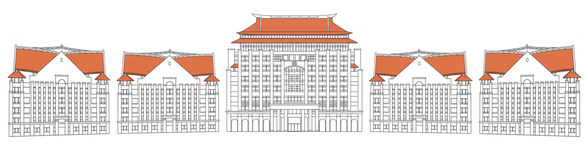

# 首页

## 欢迎来到 **XMUM XCPC Wiki**！  

这里是厦门大学马来西亚分校的 XCPC（ACM-ICPC / CCPC）代码与知识库。

本项目使用 `MkDocs` 配合 `Material for MkDocs` 主题构建，体验与 [OI-Wiki](https://oi-wiki.org) 网站类似。

---

厦大马校组织：[https://github.com/Xiamen-University-Malaysia](https://github.com/Xiamen-University-Malaysia)

算法竞赛小组：[https://github.com/Xiamen-University-Malaysia/XMUM_ICPC_CCPC](https://github.com/Xiamen-University-Malaysia/XMUM_ICPC_CCPC)

---

